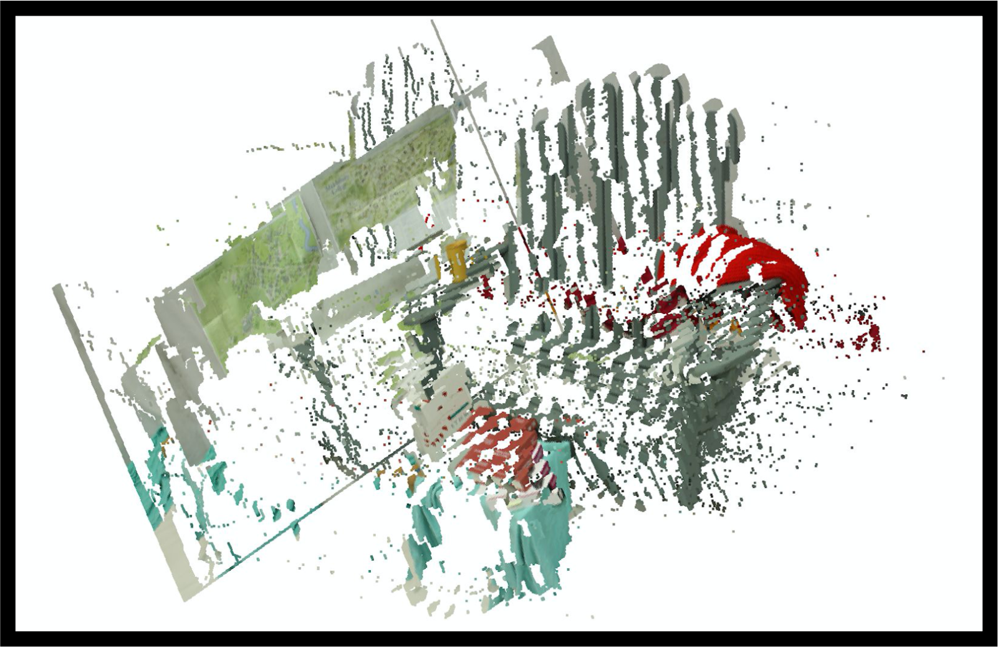

# Stereoscopic Point Cloud Generation

This program uses two 2D images as captured by a left and right camera to generate a 3D model of a scene. This allows depth awareness in software through a process similar to that of the brain.

A brief summary of the process is provided below, but the detailed description (including theory) is available <a href="./static/3D Depth Reconstruction from Stereo Images.pdf">here</a>.

## Some Results

<h4>Input Image</h4>


This is an input image, as it would appear from the left hand camera. This, combined with an almost identical right-camera view and information about how the cameras are spaced, forms the input for the algorithm.


In its first pass, the algorithm calculates a *disparity* for each pixel. That is, how far it has shifted between the left and right image. The hardest part here is identifying corresponding pixels between the two images...this sounds simple at first, but it is actually the hardest part! 

Here, we used an approach called stereo region matching, where we compare left and right pixels using a small window around them. By evaluating the similarity of the entire window, we get the similair of the pixels. This is a high level explanation--the actual algorithm used implements many more optimizations; please refer to the full report for full details. Below are the results of disparity estimation: brighter areas correspond to surfaces closer to the camera.

Disparity Map | Angled Disparity Map
:------------:|:--------------------:
|

These disparities are then triangulated to generate a 3D point cloud. Again, full details are provided in the report linked above. Visible below-left, this point cloud is fairly accurate, but suffers from some imperfections. The most significant limitation is that disparity-based depth estimation is **quantized.** That is, depth is only calculated in discrete slices. As such, the cloud looks sparse and choppy.

This is addressed by post-processing the cloud with the following goals.

- Accurately represent smooth changes in depth for smooth surfaces.
- Prevent noise around occluding surfaces.
- Make contiguous regions appear solid.
- Be image agnostic.

 By recursively comparing nearby points with eachother, as well as the original image, the algorithm is able to modify the cloud until it appears smoother, cleaner, and more solid. Both stages are shown below. 


#### Point Clouds
Raw  | Post Processed
:------------:|:--------------------:
|


#### Final Result


Ultimately, we're able to convert the 2D scene into the model above, which we can explore in full 3D. 

## Running

```bash
    python3 main.py
```
